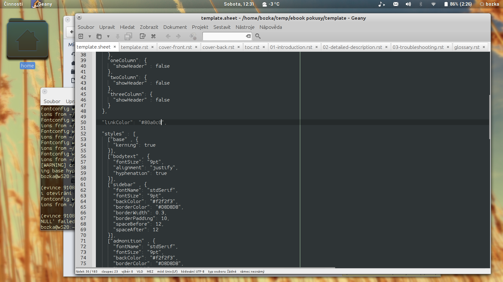

Introduction
############

When writing text with markup -- reStructuredtext -- you can use for instance:
*italic*, **bold**, :sup:`superscript`, :sub:`subscript`, :red:`colored text`, 
``inline code``, `web hyperlinks <http://www.python.org>`_ or `local links`_ in the same document [#]_.

.. [#] This is a footnote.

.. space:: 12

   
   Figure :counter:`figure`: A screenshot

Blocks
======

Block quote:

    This is an indented paragraph.

Line block:

    | For some text like addresses, verse or citations,
    | line blocks can be used as well.

Literal block:

:: 

  Whitespace, newlines, blank lines, and 
  all kinds of markup (like *this* or 
  \this) is preserved by literal blocks. 

  The paragraph containing only '::' 
  will be omitted from the result. 

Per-line quoting:: 

> Useful for quotes from email and 
> for Haskell literate programming.	

Lists and fields
================

Bullet lists
------------

- Item 1
- Item 2

  - Item 3

    - Item 4

      - Item 5
      - Item 6

  - Item 7

Enumerated lists
----------------

4. This is the first item 

   a. Subitem 1
   b. Subitem 2

5. Enumerators are arabic numbers, 
   single letters, or roman numerals 
6. List items should be sequentially 
   numbered, but need not start at 1 
   (although not all formatters will 
   honour the first index). 
#. This item is auto-enumerated

Fields 
------

:width: some description
:height: another description
:air pressure: one more description

Option lists
------------

-a          Option 1
-b number   Option 2 with parameter
--long      Another option

Tables
======

Grid table:

+------------+------------+-----------+ 
| Header 1   | Header 2   | Header 3  | 
+============+============+===========+ 
| body row 1 | column 2   | column 3  | 
+------------+------------+-----------+ 
| body row 2 | Cells may span columns.| 
+------------+------------+-----------+ 
| body row 3 | Cells may  | - Option1 | 
+------------+ span rows. | - Option2 | 
| body row 4 |            |           | 
+------------+------------+-----------+
| body row 5 |            |           | 
+------------+------------+-----------+ 

Conclusion
==========

Lorem ipsum dolor sit amet, consectetuer adipiscing elit. Suspendisse pede. Nam auctor. 
Donec ac urna. Quisque tempus, dui sit amet cursus euismod, leo arcu ullamcorper ligula, 
a elementum elit augue eu ipsum. Donec sem. Aliquam adipiscing nunc ut ante. Praesent 
consectetuer lacinia nulla. Pellentesque ut augue nec ante gravida vestibulum. Nunc 
dignissim odio ut elit. Pellentesque habitant morbi tristique senectus et netus et malesuada 
fames ac turpis egestas. Lorem ipsum dolor sit amet, consectetuer adipiscing elit. 
Suspendisse malesuada porta sapien. Suspendisse congue. Morbi eget nulla at purus auctor 
molestie. Nulla nec orci. Duis condimentum luctus sem. Etiam elementum, turpis non blandit 
molestie, magna felis faucibus risus, eu ultrices risus lacus at ante. Nullam sed dui nec 
eros iaculis facilisis.

.. sidebar:: Outside the flow

   This sidebar is outside the flow of the text.
   
   Lorem ipsum dolor sit amet, consectetuer adipiscing elit. Suspendisse pede. Nam auctor. 
   Donec ac urna. Quisque tempus, dui sit amet cursus euismod, leo arcu ullamcorper ligula, 
   a elementum elit augue eu ipsum.

.. warning:: Playing with ``rst2pdf`` and reST may be sometimes a bit tricky.

.. _`local links`:

So, this was a very short introduction to the markup syntax.
You can find more detailed information about reStructuredText format
at http://docutils.sf.net/docs/ref/rst/restructuredtext.html.

